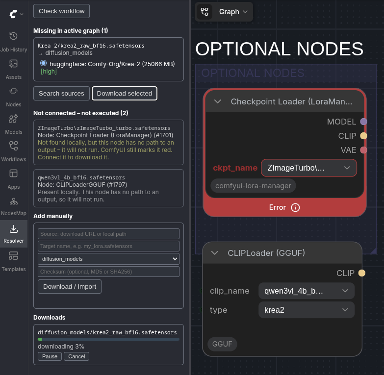

# ComfyUI-ModelResolver

Detects models that are **actually** missing in the active workflow graph
(muted, bypassed and disconnected nodes are ignored) and resolves them via
Civitai, Hugging Face and manual sources — with exact-filename matching and
SHA256/MD5 verification.

Unlike the built-in "missing models" dialog, this only offers to download
what the workflow really needs, distinguishes "missing" from "present but
just named differently", and verifies every download by checksum before it
lands in your models folder.

## Screenshot

## Features

- **Accurate analysis** — walks the active graph (reachable from outputs),
  ignores muted/bypassed nodes, and detects model references
  generically via each node's `INPUT_TYPES`, so custom-node loaders work too.
- **Multi-source resolution** — searches Civitai (with optional NSFW opt-in)
  and Hugging Face, verifies candidates by exact filename and file type, and
  de-duplicates identical files across sources by SHA256.
- **Verified downloads** — resumable (HTTP range), streaming SHA256/MD5,
  checksum verified before the file is moved into place. Civitai token and
  Hugging Face token handled per host.
- **Manual add / import** — download from any URL or import a local file
  (e.g. a browser download), with checksum verification and folder selection.
- **Present-but-renamed detection** — recognises files you already have that
  the workflow references under a browser/OS duplicate name (e.g. ` (2)`),
  and lets you verify identity by hash instead of re-downloading.
- **Not-connected reporting** — models referenced by nodes that have no path
  to an output are listed separately instead of being silently dropped.
  ComfyUI still marks such a node red, so without this the panel would appear
  to have missed something.

## Installation

Copy the `ComfyUI-ModelResolver` folder into `ComfyUI/custom_nodes/` and
restart ComfyUI. No extra dependencies (uses aiohttp, shipped with ComfyUI).

## Configuration

On first start a `config.json` is created in the extension folder:

| Key | Default | Description |
|---|---|---|
| `civitai_api_key` | `""` | For Civitai downloads (create at civitai.com/user/account) |
| `hf_token` | `""` | Optional, only needed for gated Hugging Face repos |
| `include_nsfw` | `false` | Opt-in, searches Civitai with `nsfw=true` |
| `sources.civitai` | `true` | Toggle Civitai as a resolution source |
| `sources.huggingface` | `true` | Toggle Hugging Face as a resolution source |
| `search_limit` | `20` | Max results fetched per query and source |
| `request_timeout` | `20` | HTTP request timeout in seconds |
| `max_parallel_downloads` | `2` | Concurrent downloads (1–8) |

**Never commit `config.json`** — it contains your API key and is git-ignored.
The file is re-read on every request, so changes take effect without
restarting ComfyUI.

## Usage

Open a workflow. The **Model Resolver** sidebar tab shows what's missing.
Click *Search sources*, pick candidates, *Download selected*. Files are
verified and placed in the correct folder.

**After a download finishes, the node is not updated automatically.** Refresh
the node list (press `R` on the canvas, or reload) and then pick the newly
downloaded file in the loader node's dropdown — the red "Error" on the node
clears once a valid file is selected. This is a ComfyUI behaviour: adding a
file to a folder doesn't change what a node currently points to.

Running downloads can be paused, resumed or cancelled from the download list.
Pausing keeps the partial file (it resumes where it left off); cancelling
discards it.

### Add manually

Some files aren't on Civitai or Hugging Face — for example models hosted only
on ModelScope, RunningHub or a mirror found via [CivArchive](https://civarchive.com).
For these, use the **Add manually** section:

- **Source** — a direct download URL, *or* a local file path (to import a file
  you already downloaded in your browser; the original is copied, not moved).
- **Target name** — the exact filename the workflow expects.
- **Folder type** — where it goes (the list is populated from your actual
  model folders, including custom-node folders; it is preselected from the
  missing entry when possible).
- **Checksum** *(optional)* — an MD5 or SHA256 (auto-detected by length).
  If given, the download is verified against it before being placed; a
  mismatch is rejected and nothing broken lands in your folder.

When a search comes up empty, the panel also offers direct **CivArchive** and
**RunningHub** search links for the distilled filename, so you can grab the URL
and checksum and drop them straight into *Add manually*.

### Already have the file under a different name?

If the workflow references a file you already have but under a browser/OS
duplicate name (e.g. `model (2).safetensors`), it appears under *Present, just
named differently* rather than as missing — no download needed, just select
your existing file in the node. *Verify identity via hash* confirms it really
is the same file.

## How it works

### Graph analysis

Analysis operates on ComfyUI's API/prompt format (the same one produced by
"Save (API Format)"), which already reflects execution state — muted nodes
are absent and bypass is wired through. From there:

1. **Reachability** — walks backward from every `OUTPUT_NODE`; only nodes
   reachable from an output generate download requirements, so disconnected
   ("dead island") branches never trigger a download.
2. **Widget detection** — evaluates `INPUT_TYPES()` per node class. Any combo
   input whose option list matches a `folder_paths` file list is treated as
   a model reference, which also identifies the target folder type
   generically, without hardcoding node names.
3. **Missing vs. present vs. renamed** — a value not in the current option
   list is checked against your actual files: same basename under a
   different registered path → *present, differently named*; same basename
   after stripping local duplicate suffixes (` (2)`, ` copy`, ` - Kopie`) →
   *present, renamed*; otherwise → *missing*.
4. **Not connected** — nodes that are present in the prompt but unreachable
   from any output are reported in their own section, with folder type and
   whether the file exists locally. They are never downloaded; the section
   exists to explain why ComfyUI flags such a node red while nothing is
   reported as missing.

### Query distillation & search

Civitai and Hugging Face search match model **names**, not filenames, so each
missing filename is distilled into staged queries: the full stem, then a
"core" version with version/format noise tokens stripped (`v2`, `fp16`,
`gguf`, `scaled`, …), then the single longest remaining token. Queries run in
order and stop at the first one that returns a verified hit.

A candidate only counts on an **exact filename match** (case-insensitive,
noted separately) within a model's file list — search relevance alone is
never enough. The target folder type from analysis further filters false
hits (e.g. a `loras` reference won't surface an unrelated checkpoint).

### Confidence & deduplication

- Candidates found on multiple sources with the same SHA256 are merged into
  one entry with all sources listed.
- **High confidence** — exact filename match with no type contradiction.
- **Medium confidence** — exact filename match *or* type match, not both.
- **Low confidence** — neither.

### Verified downloads

Downloads stream to a `.part` file while computing SHA256/MD5 on the fly.
Resuming re-hashes the existing partial content first, then continues via
HTTP `Range` requests. The file is only renamed to its final name **after**
a checksum match — on mismatch, the partial file is kept under `.badsha` for
inspection instead of being silently discarded. Civitai auth is passed as a
`?token=` query parameter (a plain `Authorization` header breaks when Civitai
redirects to object storage); Hugging Face auth uses a standard header.

## Troubleshooting

**Node still shows a red error after a successful download.** Expected —
ComfyUI doesn't auto-refresh a node's dropdown when a new file appears on
disk. Press `R` on the canvas or reload, then pick the file manually.

**A node is red, but the panel reports no missing models.** Check the
*Not connected — not executed* section. If the node has no path to an output
it will never run, so nothing is downloaded for it; ComfyUI marks it red
purely because the selected value isn't in its dropdown. Connect the node to
an output and scan again to have it resolved.

**A model I know exists on Civitai isn't found.** Search matches on the
model's *name*, not the filename, and requires an exact filename match
within that model's files. Very generic or heavily abbreviated filenames may
not distill into a query that finds the right model — use **Add manually**
with a direct URL instead.

**NSFW models don't show up in search results.** Enable `include_nsfw` in
`config.json` (opt-in by design).

**Download fails with a checksum mismatch.** The partial file is kept as
`<filename>.badsha` next to the target rather than deleted, so you can
inspect it. This means the source served different bytes than the reported
hash — usually a transient CDN/mirror issue; retrying often resolves it.

**Hugging Face download fails with "HTTP 403 during download".** This is
almost always a **gated repo**, not a tool problem: your `hf_token` is valid,
but you haven't been granted access to that specific repo yet. Visit the
model page on huggingface.co, accept the license / click "Agree and access
repository", wait for approval (often instant, sometimes manual), then
retry the download with the same token.

## Roadmap

- CivArchive as an automatic resolution source (archived/mirrored models)
- LoRA-tag parsing from prompt text (e.g. `<lora:name:1.0>`)
- Special-case support for loader nodes like rgthree's Power Lora Loader

## License

MIT
